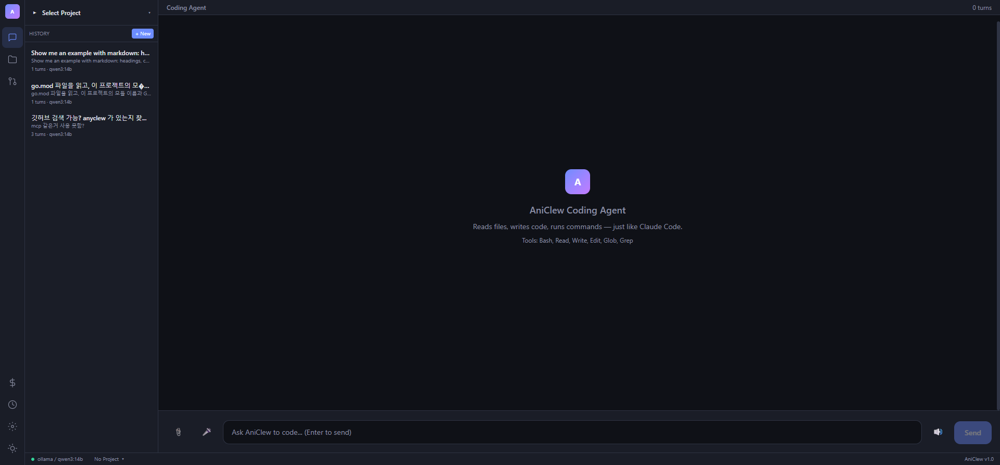
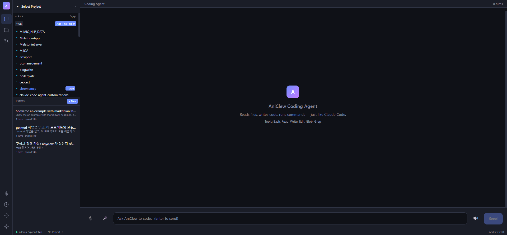
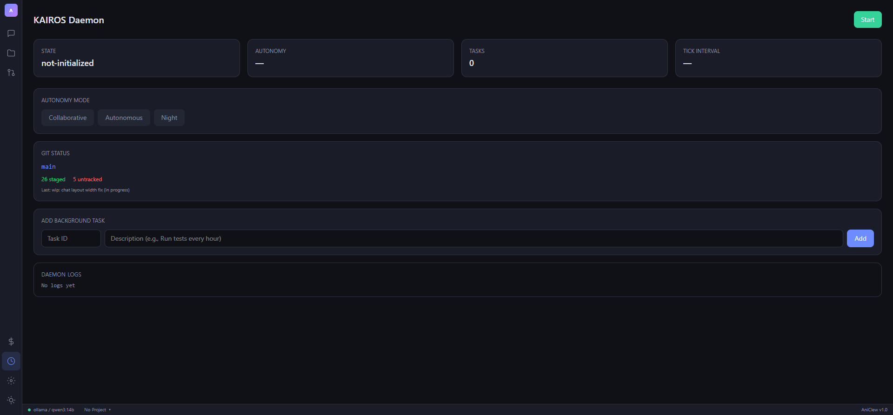
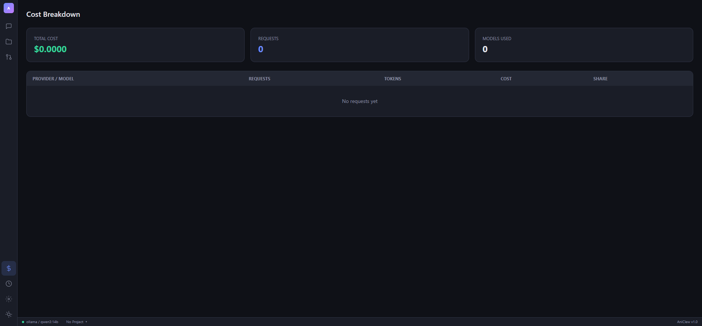

# AniClew

**Any Model, One Agent** — LLM Harness that unifies Claude CLI, Codex CLI, and Gemini CLI under a single proxy with a web dashboard.

AniClew sits between your coding CLI tools and LLM providers, giving you multi-provider routing, per-project management, multi-agent orchestration, and a visual control plane.

## Screenshots

| Chat (Thinking model) | Project Browser |
|------|----------------|
|  |  |

| KAIROS Daemon | Observability |
|--------------|----------|
|  |  |

## Features

### Multi-Provider Proxy
- **7 providers**: Anthropic, OpenAI, Gemini, Groq, Ollama, GitHub Copilot, z.ai (Grok)
- **Auth passthrough**: CLI tools send their own API keys through AniClew transparently
- **Runtime switching**: Change provider/model without restarting
- **Smart retry**: Exponential backoff with jitter, 529 fallback model switching
- **Smart router**: Auto-route requests by role (coding, review, chat)

### Coding Agent
- **Tool-using agent**: Bash, Read, Write, Edit, Glob, Grep
- **Thinking model support**: qwen3, DeepSeek-R1 reasoning in collapsible blocks
- **23 security validators**: Shell injection detection, dangerous path blocking, sed/jq execution prevention
- **60+ read-only allowlist**: Per-command flag validation for safe auto-approval
- **Parallel tool execution**: Read-only tools run concurrently, write tools serial
- **Context auto-compaction**: LLM-based summarization with snip fallback + circuit breaker

### Multi-Agent Teams
- **Wave execution**: Topological sort (Kahn's algorithm) for dependency-based parallelism
- **File ownership**: Hard enforcement at ExecuteTool level
- **6 agent types**: Explorer, Researcher, Planner, Coder, Reviewer, Tester
- **Mailbox**: File-based inter-agent messaging with locking + broadcast
- **Message router**: Live channel delivery with mailbox fallback
- **Plan mode**: Explore -> Design -> Approve -> Implement lifecycle
- **Worktree isolation**: Git worktree per agent for conflict-free parallel work
- **Idle detection**: Callback chain with timestamp tracking

### Project Management
- **Multi-project**: Register, switch, remove projects via folder browser
- **File tree**: Recursive tree with click-to-view file content
- **Session isolation**: Per-workspace chat history filtering
- **Auto-detection**: Go, Node, Python, Rust, Java, .NET framework detection

### KAIROS Daemon
- **Background agent**: 2-minute tick cycle with cron scheduling
- **Cron parser**: 5-field expressions + presets (@hourly, @daily, @every 5m)
- **Git Watch**: Auto-monitors git status, detects changes, logs summaries
- **Notifications**: SSE real-time stream + webhook integration
- **Per-project**: Tasks and memory isolated per workspace

### Observability
- **Request tracing**: Per-request provider, model, latency, tokens, cost (JSONL persistence)
- **Metrics**: Average/P95 latency, error rate, requests/min, per-provider breakdown
- **Stream watchdog**: 90s idle timeout with context abort
- **Response quality**: Thumbs up/down feedback with per-model scoring
- **Prompt cache**: Strategy tracking, break detection, savings estimation

### Hooks & Permissions
- **Hook system**: CLI-aware loading (Claude/Codex/Gemini settings), pre/post tool use
- **6-level permission cascade**: CLI flags > policy > local > user > project > defaults
- **Immutable snapshots**: Captured at session start, no mid-session drift
- **Denial tracking**: Auto-persist deny rule after 3 consecutive denials
- **Permission persistence**: Allow/deny rules saved to .claude/settings.json

### Security
- **Token auth**: Optional `accessToken` in config
- **Path sandboxing**: Tools restricted to workspace directory
- **BashTool**: Quote-aware parser, compound command splitting, auto-backgrounding
- **Exit code semantics**: grep 1 = no match (not error), diff 1 = files differ

### Extensibility
- **Plugin system**: JSON manifest with tools, hooks, commands, agent types
- **MCP integration**: Stdio client with timeout, health check, auto-reconnect
- **Bridge mode**: HTTP remote control for IDE/script integration
- **Session memory**: Disk-backed large result storage (saves tokens)

## Quick Start

```bash
# Build
cd web && npm install && npm run build && cd ..
cp -r web/dist/* internal/server/webdist/
go build -o aniclew ./cmd/proxy

# Run
./aniclew -provider ollama -model qwen3:14b

# Connect CLI
ANTHROPIC_BASE_URL=http://localhost:4000 claude
```

Browser opens at `http://localhost:4000/app`.

## Configuration

`~/.claude-proxy/config.json`:

```json
{
  "port": 4000,
  "defaultProvider": "ollama",
  "defaultModel": "qwen3:14b",
  "accessToken": "",
  "projects": [
    { "path": "/path/to/project", "name": "My Project" }
  ],
  "providers": {
    "ollama-remote": { "baseUrl": "http://192.168.1.100:11434" }
  }
}
```

## Architecture

```
CLI Tools (Claude/Codex/Gemini)
        |
        v
  +-----------+     +---------+
  |  AniClew  | <-> | Web UI  |
  +-----------+     +---------+
   |    |    |
   v    v    v
Anthropic OpenAI Ollama ...
   |
   +-- Agent Loop (tools, hooks, permissions)
   +-- KAIROS Daemon (cron, git-watch)
   +-- Team (waves, mailbox, worktree)
   +-- Observability (traces, metrics, feedback)
   +-- Plugins (tools, hooks, commands)
```

## API

| Endpoint | Description |
|----------|-------------|
| `POST /v1/messages` | Anthropic-compatible proxy |
| `GET/PUT /api/config` | Provider & settings |
| `GET/POST/DELETE /api/projects` | Project management |
| `GET /api/tree` | File tree |
| `GET /api/file` | File content |
| `GET/POST /api/sessions` | Chat sessions |
| `POST /api/agent` | Coding agent (SSE) |
| `POST /api/team` | Team execution (SSE) |
| `POST /api/chronos` | Autonomous loop (SSE) |
| `GET/POST /api/kairos/*` | Daemon control |
| `GET /api/traces` | Request traces |
| `GET /api/metrics` | Computed metrics |
| `GET/POST /api/feedback` | Response quality |
| `GET /api/hooks` | Loaded hooks |
| `GET /api/permissions` | Permission snapshot |
| `GET /api/agent-types` | Available agent types |
| `GET /api/worktrees` | Git worktrees |
| `GET /api/mcp` | MCP servers |

## Stats

- **17,871 lines** Go backend
- **214 tests** across 4 packages
- **95% technical fidelity**
- **11 runtime-verified features**

## License

MIT
