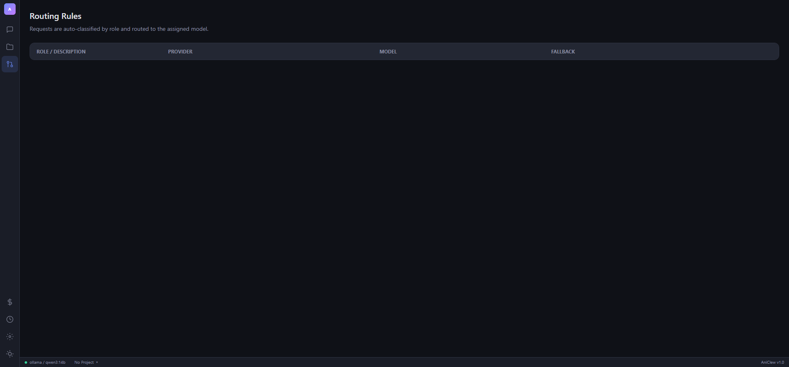

# AniClew

**Any Model, One Agent** — LLM Harness that unifies Claude Code, Codex CLI, and Gemini CLI under a single proxy with a web dashboard.

AniClew sits between your coding CLI tools and LLM providers, giving you multi-provider routing, per-project management, background automation, and a visual control plane.

## Screenshots

| Chat | Project Browser |
|------|----------------|
|  |  |

| KAIROS Daemon | Settings |
|--------------|----------|
|  |  |

| Routes | Costs |
|--------|-------|
|  |  |

## Features

### Multi-Provider Proxy
- **7 providers**: Anthropic, OpenAI, Gemini, Groq, Ollama, GitHub Copilot, z.ai (Grok)
- **Auth passthrough**: Claude Code, Codex CLI, Gemini CLI send their own API keys through AniClew transparently
- **Runtime switching**: Change provider/model without restarting
- **Smart router**: Auto-route requests by role (coding, review, chat)

### Coding Agent
- **Tool-using agent**: Bash, Read, Write, Edit, Glob, Grep — like Claude Code in a browser
- **Thinking model support**: qwen3, DeepSeek-R1 reasoning displayed in collapsible blocks
- **Streaming**: Real-time token streaming with Anthropic SSE format translation
- **Session management**: Per-project chat history with auto-save

### Project Management
- **Multi-project**: Register multiple projects, switch between them
- **File tree**: Browse project files with syntax-colored tree view
- **Session isolation**: Each project has its own chat history
- **Auto-detection**: Go, Node, Python, Rust, Java, .NET — framework detection included

### KAIROS Daemon
- **Background agent**: Always-on daemon that runs tasks on a 2-minute tick cycle
- **Git Watch**: Monitors git status, detects changes, logs summaries automatically
- **Autonomy modes**: Collaborative / Autonomous / Night
- **Task persistence**: Tasks saved per-project in `tasks.json`
- **Notifications**: SSE real-time stream + webhook integration

### Memory & Intelligence
- **AutoDream Memory**: Per-project key-value memory with auto-consolidation (25KB limit)
- **A/B Tester**: Compare model responses side-by-side
- **PR Reviewer**: GitHub webhook-driven auto PR review (skeleton)
- **Cost tracking**: Per-provider token and cost breakdown

### Security
- **Token auth**: Optional `accessToken` in config — protects web UI and API
- **Path sandboxing**: Tools restricted to project workspace directory
- **Passthrough auth**: CLI API keys never stored, forwarded transparently

## Quick Start

### Prerequisites
- Go 1.22+
- Node.js 18+ (for building the web UI)
- Ollama (optional, for local models)

### Build

```bash
# Clone
git clone https://github.com/Dannykkh/Ani-Clew.git
cd Ani-Clew

# Build frontend
cd web && npm install && npm run build && cd ..

# Copy web assets
cp -r web/dist/* internal/server/webdist/

# Build binary
go build -o aniclew ./cmd/proxy
```

### Run

```bash
# Interactive mode (select provider)
./aniclew

# Direct mode
./aniclew -provider ollama -model qwen3:14b

# With specific port
./aniclew -provider openai -model gpt-4o -port 8080
```

The browser opens automatically at `http://localhost:4000/app`.

### Connect CLI Tools

```bash
# Claude Code
ANTHROPIC_BASE_URL=http://localhost:4000 claude

# Codex CLI
OPENAI_BASE_URL=http://localhost:4000 codex

# Any OpenAI-compatible tool
OPENAI_BASE_URL=http://localhost:4000 your-tool
```

## Configuration

Config file: `~/.claude-proxy/config.json`

```json
{
  "port": 4000,
  "defaultProvider": "ollama",
  "defaultModel": "qwen3:14b",
  "accessToken": "",
  "routerEnabled": false,
  "projects": [
    { "path": "D:/git/my-project", "name": "My Project" }
  ],
  "providers": {
    "ollama-home": { "baseUrl": "http://192.168.1.100:11434" },
    "ollama-office": { "baseUrl": "http://10.0.0.50:11434" }
  }
}
```

## Architecture

```
CLI Tools (Claude/Codex/Gemini)
        |
        v
  +-----------+
  |  AniClew  |  <- Proxy + Agent + Dashboard
  +-----------+
        |
   +----+----+----+----+
   |    |    |    |    |
Anthropic OpenAI Gemini Ollama ...
```

### Directory Structure

```
~/.claude-proxy/
  config.json              # Global config
  sessions/                # Per-project chat sessions
    D--git--project-a/
    D--git--project-b/
  projects/                # Per-project KAIROS data
    D--git--project-a/
      memory/entries.json  # Project memory
      tasks.json           # Daemon tasks
  memory/                  # Global memory (fallback)
```

## API

| Endpoint | Method | Description |
|----------|--------|-------------|
| `/v1/messages` | POST | Anthropic-compatible messages API |
| `/api/config` | GET/PUT | Provider & settings |
| `/api/projects` | GET/POST/DELETE | Project management |
| `/api/workspace` | GET/PUT | Active workspace |
| `/api/tree` | GET | File tree |
| `/api/sessions` | GET/POST | Chat sessions |
| `/api/kairos` | GET | Daemon status |
| `/api/kairos/start` | POST | Start daemon |
| `/api/kairos/git` | GET | Git status |
| `/api/kairos/notifications/stream` | GET | SSE notification stream |
| `/api/mcp` | GET | MCP server list |
| `/app` | GET | Web dashboard |

## Roadmap

- [ ] Observability — per-request tracing, latency metrics
- [ ] Evals — automated response quality scoring
- [ ] Multi-agent orchestration — parallel agent workers
- [ ] RAG — project-aware context retrieval
- [ ] Plugin system — user extensions
- [ ] Desktop tray app — system tray with notifications

## License

MIT
